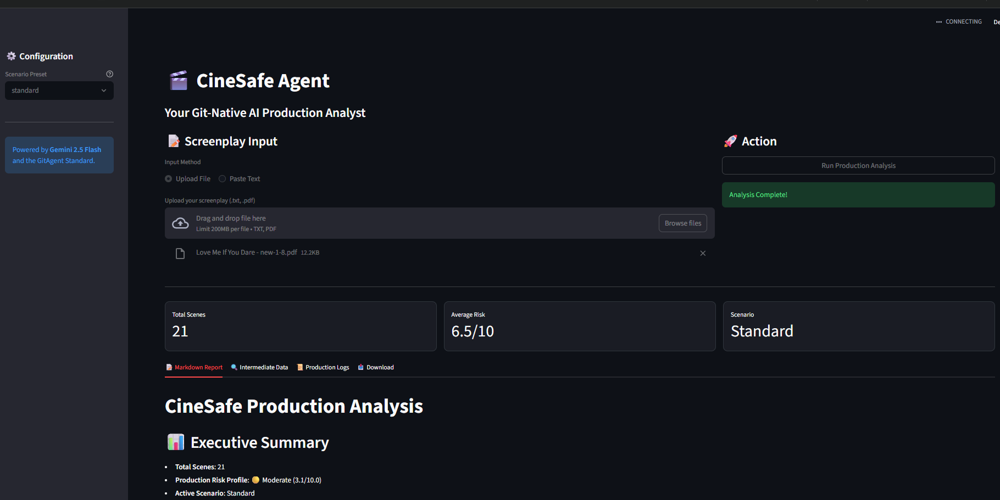
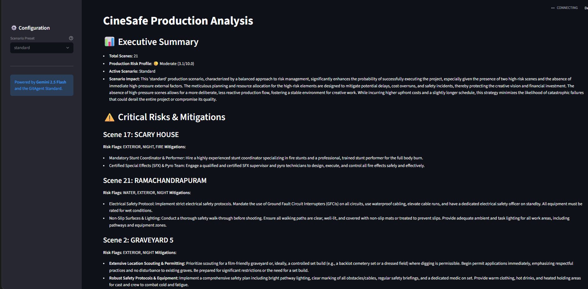
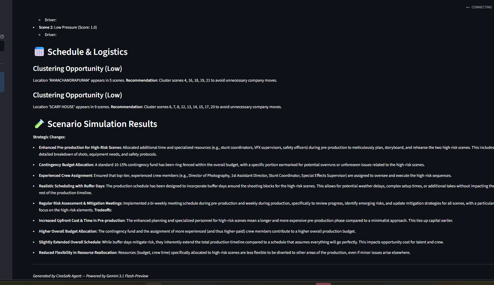
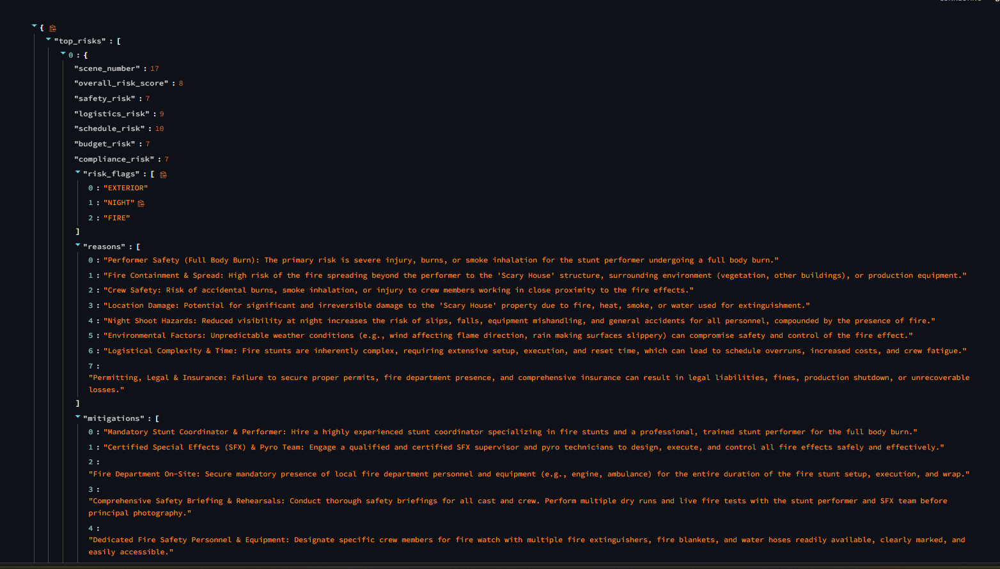

# 🎬 CineSafe Agent: Your Git-Native Production Analyst

CineSafe Agent is a specialized AI production analyst designed for the **GitAgent Hackathon**. It lives directly in your repository as a **Git-Native agent**, providing film producers with professional-grade risk, budget, and schedule analysis from raw screenplays.

---

## 🖼️ Screenshots

### Dashboard Overview


### Production Risk Report


### Schedule & Scenario Simulation


### Intermediate JSON Data


---

## 🌟 Key Features
- **🎯 Professional Script Ingestion**: Supports both `.txt` and `.pdf` files. Robustly handles complex **shooting script numbering** (e.g., `4.1`, `4.2`).
- **🛡️ Deterministic Risk Engine**: Grounded in weighted CSV heuristics (`runtime/data/risk_weights.csv`) to provide consistent, safety-first scoring.
- **💰 Budget Pressure Analysis**: Detects high-cost factors (Night shoots, Crowds, Remote locations) and provides actionable "Producer Tips."
- **🎭 Scenario Simulation**: Choose from 4 production presets to stress-test your script:
  - `standard` — Balanced planning approach
  - `budget_cut_20` — Simulates a 20% budget reduction
  - `accelerate_timeline` — Tests a compressed shooting schedule
  - `max_safety` — Maximum safety constraints applied
- **📊 Interactive Dashboard**: A sleek **Streamlit** interface with Markdown Report, Intermediate Data, Production Logs, and Download tabs.
- **📜 Deep Debugging**: Granular production logs for every internal step, from regex parsing to LLM reasoning.
- **🤖 Powered by Gemini 2.5 Flash**: Optimized for speed and sophisticated creative reasoning.

---

## 🏗️ GitAgent Open Standard Compliance
CineSafe is built strictly according to the **GitAgent standard**:
- **`agent.yaml`**: The manifest defining skills and model preferences.
- **`SOUL.md`**: Defines the agent's identity as a meticulous Line Producer.
- **`RULES.md`**: Sets boundaries for deterministic scoring and safety advice.
- **`skills/`**: Fully documented `SKILL.md` files for every agent capability.

---

## 🚀 Getting Started

### 1. Prerequisites
- Python 3.10+
- Google Gemini API Key

### 2. Installation
```powershell
# Clone the repo
git clone https://github.com/ThamillIndian/Gtt-Native-CineSafe.git
cd Gtt-Native-CineSafe

# Setup Environment
cp .env.example .env
# Edit .env and add your GEMINI_API_KEY

# Install dependencies
pip install -r requirements.txt
```

### 3. Running the Agent
```powershell
streamlit run ui/streamlit_app.py
```
1. Upload a `.txt` or `.pdf` screenplay
2. Pick a **Scenario Preset** from the sidebar
3. Click **Run Production Analysis**

### 4. Validate for GitAgent
```powershell
npx @open-gitagent/gitagent validate
```

> **Note**: `gitclaw info` requires Node.js ≥ 20.18.1. The repository is fully GitAgent-spec compliant. If you encounter a version mismatch error, upgrade Node.js or use `npx @open-gitagent/gitagent info` as an alternative.

---

## 📂 Project Structure
- `runtime/`: The core engine and modular adapters.
- `skills/`: Mandatory skill documentation for GitClaw.
- `ui/`: The interactive analysis dashboard.
- `examples/`: Sample scripts and templates.

---
Built with ❤️ for the **GitAgent Hackathon** by **ThamillIndian**.
